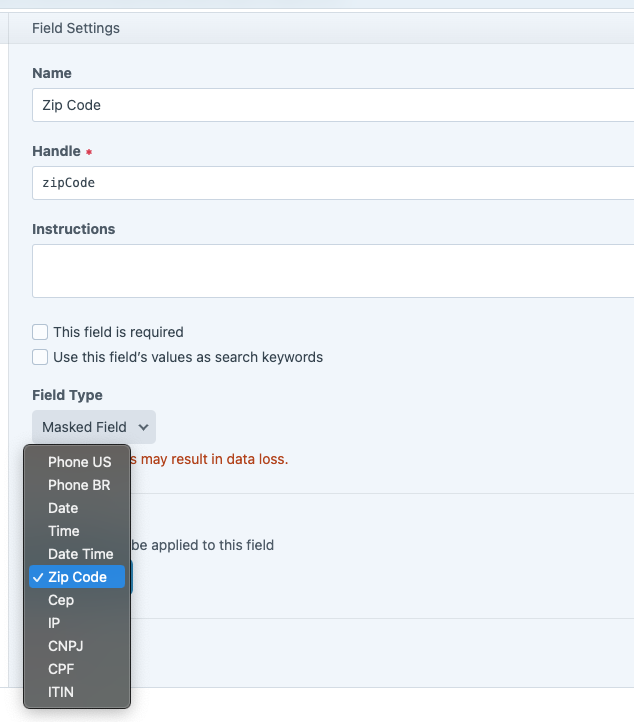

Masked Fields plugin for Craft
===

A mix of masked/validated fields for Craft

_Thanks to https://github.com/igorescobar/jQuery-Mask-Plugin_

### Installation

```bash
composer require leowebguy/masked-fields
```

On your Control Panel, go to Settings → Plugins → "Masked Fields" → Install

### Usage




### New formats

PR into https://github.com/leowebguy/masked-fields
following https://igorescobar.github.io/jQuery-Mask-Plugin patterns/schema
